# Localite — System Architecture

> Hyper-local trust-based commerce platform connecting neighborhood shops with their long-standing customers.

**Stack:** Expo React Native (mobile) · Node.js / Express (API) · PostgreSQL · Sequelize ORM  
**Pattern:** npm workspaces monorepo (`apps/api`, `apps/mobile`, `packages/shared`)

---

## Table of Contents

1. [System Overview](#1-system-overview)
2. [High-Level Architecture](#2-high-level-architecture)
3. [Monorepo Structure](#3-monorepo-structure)
4. [Authentication & Security](#4-authentication--security)
5. [Role-Based Access Control (RBAC)](#5-role-based-access-control-rbac)
6. [Functional Modules](#6-functional-modules)
7. [Database Schema](#7-database-schema)
8. [Order Lifecycle](#8-order-lifecycle)
9. [Payment Flow](#9-payment-flow)
10. [Onboarding Flows](#10-onboarding-flows)
11. [Notifications](#11-notifications)
12. [File Storage](#12-file-storage)
13. [API Reference Map](#13-api-reference-map)
14. [Mobile App Navigation](#14-mobile-app-navigation)
15. [External Integrations](#15-external-integrations)
16. [Secrets & Configuration Management](#16-secrets--configuration-management)
17. [Dev Tooling & Scripts](#17-dev-tooling--scripts)

---

## 1. System Overview

Localite is **not** a warehouse marketplace (Blinkit/Instamart model). It is a **trust bridge** between established neighborhood shops and their regular customers.

| Dimension | Warehouse Model | Localite Model |
|-----------|----------------|----------------|
| Inventory | Central warehouse | Shopkeeper sources locally |
| Delivery | Own fleet / couriers | Shop's own staff |
| Catalog (MVP) | Full product listing | Visual catalog (Flowers/Nursery) **or** free-text list / photo for other shops |
| Pricing | Fixed at checkout | Shopkeeper confirms amount after accepting order |
| Payment | Prepaid dominant | UPI (Razorpay) or Cash on Delivery |
| Relationship | Anonymous | Known customer ↔ known shop |

> **Bulk Buy (v0.11):** Group electronics campaigns — separate module from grocery orders. See [`docs/bulk-buy-architecture.md`](./bulk-buy-architecture.md).

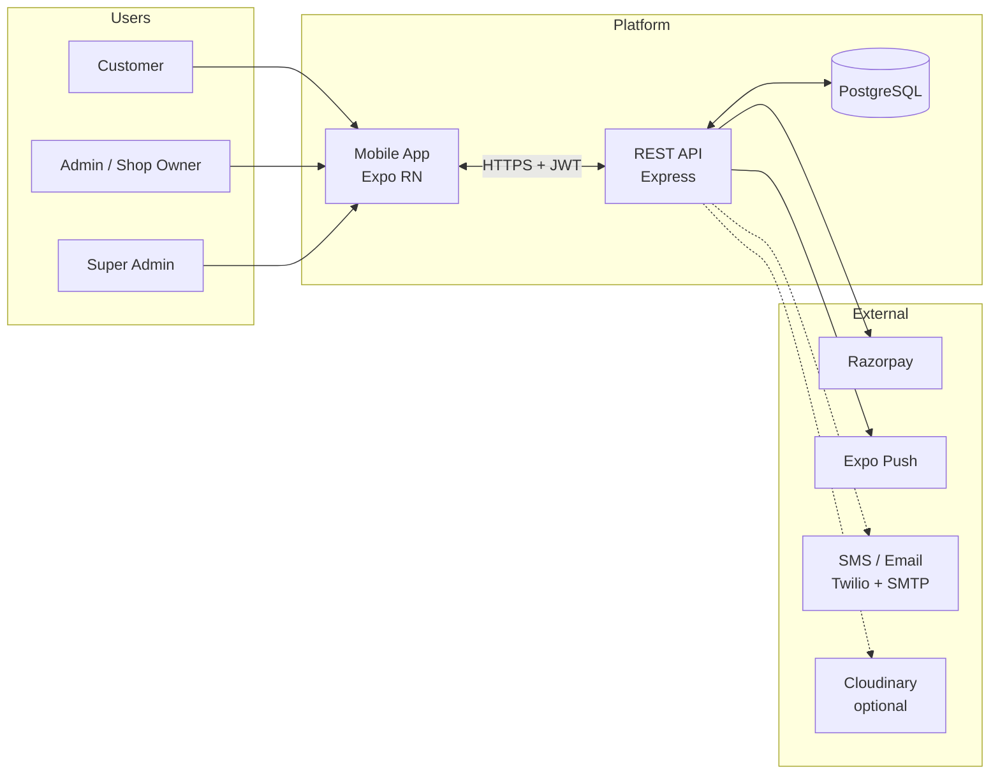

---

## 2. High-Level Architecture

```mermaid
flowchart TB
    subgraph ClientLayer["Client Layer"]
        MA[Mobile App\nReact Native / Expo]
        MA --> NAV[Role-Based Navigation]
        NAV --> CS[Customer Screens]
        NAV --> AS[Admin Screens]
        NAV --> SS[Super Admin Screens]
        NAV --> ONB[Onboarding Screens]
        NAV --> AUTH_UI[Login Screen\nPassword + OTP tabs]
    end

    subgraph APILayer["API Layer — Express.js"]
        direction TB
        MW[Middleware Stack]
        MW --> HELMET[Helmet\nSecurity Headers]
        MW --> CORS[CORS]
        MW --> RATE[Rate Limiter]
        MW --> JWT_MW[JWT Authenticate]
        MW --> RBAC[requireRole / requireOnboarded]

        ROUTES[Route Modules]
        ROUTES --> AUTH_R[/api/auth]
        ROUTES --> AREA_R[/api/areas]
        ROUTES --> SHOP_R[/api/shops]
        ROUTES --> ORDER_R[/api/orders]
        ROUTES --> SUPPORT_R[/api/support]
        ROUTES --> ADMIN_R[/api/admin]
        ROUTES --> WEBHOOK_R[/api/webhooks]
    end

    subgraph ServiceLayer["Service Layer"]
        S1[cryptoService\nbcrypt, OTP hash]
        S2[tokenService\nJWT + registration tokens]
        S3[otpService\nOTP sessions]
        S4[orderStateMachine\nstatus transitions]
        S5[orderService\nevents + details]
        S6[storageService\nlocal / cloudinary]
        S7[notificationService\nExpo push]
        S8[razorpayService\nUPI payments]
        S9[captchaService\nmath + reCAPTCHA]
        S10[userService\nidentity normalization]
        S11[shopService\ncodes, invites, listings]
        S12[messagingService\nSMS + email]
        S13[supportSchemaMigration\nuserSchemaMigration]
    end

    subgraph DataLayer["Data Layer"]
        SEQ[Sequelize ORM]
        PG[(PostgreSQL)]
        LOCAL[Local Uploads\n/uploads]
        CLOUD[Cloudinary CDN\noptional]
    end

    MA -->|REST + Bearer Token| MW
    MW --> ROUTES
    ROUTES --> ServiceLayer
    ServiceLayer --> SEQ
    SEQ --> PG
    S6 --> LOCAL
    S6 -.-> CLOUD
    WEBHOOK_R --> S8
    S8 --> RZP_EXT[Razorpay API]
    S7 --> EXPO_EXT[Expo Push API]
```

---

## 3. Monorepo Structure

```text
Localite/
├── apps/
│   ├── api/                        # Backend REST API
│   │   ├── scripts/
│   │   │   ├── run-migrations.js   # run schema patches without full boot
│   │   │   └── sync-demo-data.js   # upsert demo users + shop owners
│   │   ├── src/
│   │   │   ├── config/
│   │   │   │   └── loadEnv.js      # loads .env + dev.local
│   │   │   ├── server.js           # Express bootstrap + boot migrations
│   │   │   ├── database.js         # Sequelize connection
│   │   │   ├── models/             # ORM models + associations
│   │   │   ├── routes/             # HTTP route handlers
│   │   │   ├── middleware/         # auth, rate limit, errors
│   │   │   ├── services/           # business logic + schema migrations
│   │   │   ├── utils/pagination.js # shared paginated responses
│   │   │   └── seeders/seed.js     # demo data
│   │   ├── uploads/                # local file storage
│   │   ├── .env.example            # ✅ committed — non-secret defaults
│   │   ├── dev.local.example       # ✅ committed — secret key template
│   │   └── dev.local               # 🚫 gitignored — real passwords & keys
│   │
│   └── mobile/                     # Expo React Native app
│       ├── App.js                  # root navigator + role routing
│       └── src/
│           ├── components/         # ProfileBar, ScreenLayout, OrderSupportButton
│           ├── config/devDemoAccounts.js  # dev quick-fill logins (__DEV__)
│           ├── context/AuthContext.js
│           ├── services/api.js     # HTTP client + token refresh
│           ├── utils/profile.js    # resolveMediaUrl, getPrimaryShop
│           └── screens/
│               ├── LoginScreen.js
│               ├── customer/       # shop browse, orders
│               ├── shopkeeper/       # inbox, manage orders, invitations
│               ├── admin/            # super admin dashboard (shops + users)
│               ├── profile/          # ProfileScreen, ProfileOrdersScreen
│               └── onboarding/       # customer + admin setup
│
├── packages/
│   └── shared/                     # shared enums & constants
│       └── src/
│           ├── enums.js
│           └── shopUtils.js        # isShopPubliclyListed, isShopOrderable
│
├── docs/
│   ├── architecture.md             # this file
│   ├── database.md                 # how to apply schema + seed
│   ├── app.sql                     # canonical PostgreSQL schema (v0.4)
│   ├── seed-data.sql               # demo data with fixed UUIDs
│   └── apicurl/                    # curl docs + Postman collection
│
├── .gitignore                      # blocks dev.local, .env, secrets/
└── docker-compose.yml              # PostgreSQL container
```

---

## 4. Authentication & Security

### 4.1 Dual Login Methods

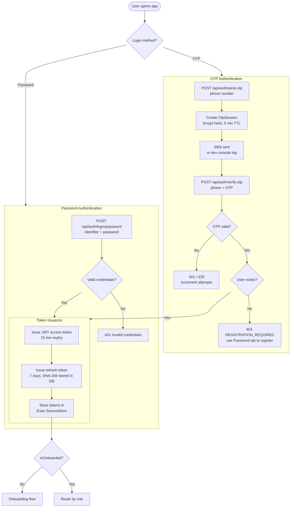

### 4.2 Registration (Password + Email Verification)

Registration is a **three-step** flow. Self-registration as `super_admin` is not allowed.

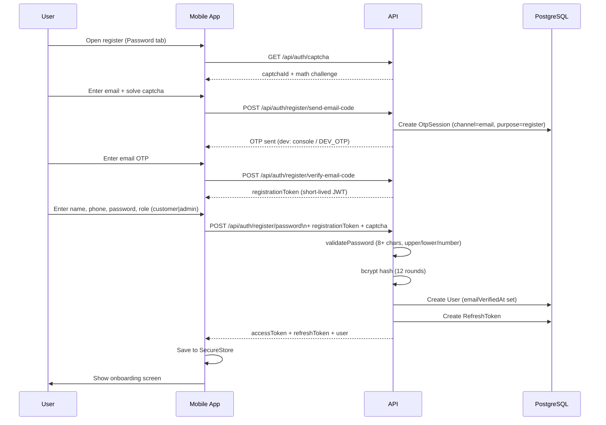

### 4.3 Token Refresh Flow

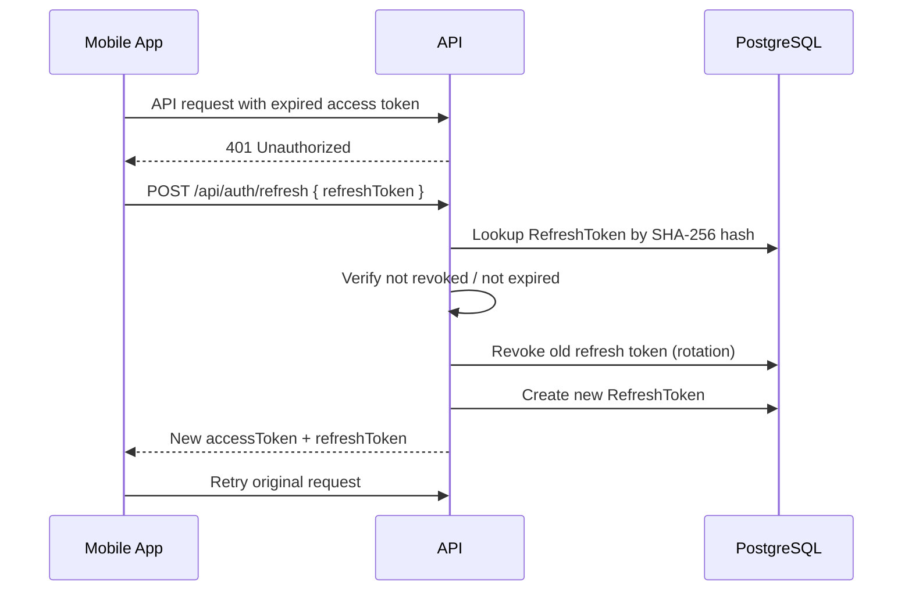

### 4.4 Security Controls

| Control | Implementation |
|---------|----------------|
| Password hashing | bcrypt, 12 rounds (`BCRYPT_ROUNDS`) |
| OTP storage | bcrypt-hashed, never stored in plaintext |
| OTP expiry | 5 minutes (`OTP_TTL_MS`) |
| OTP brute-force | Max 5 attempts per session, then invalidated |
| Rate limiting | `authLimiter` on login/register/OTP only — 30 req/15 min (prod), 500 (dev); `otpLimiter` 3/min per phone (prod), 100 (dev); set `DISABLE_AUTH_RATE_LIMIT=true` in dev to skip |
| Account status | `accountStatus` (`enabled` / `disabled` / `on_hold`) checked at login and on every JWT request; disabled accounts have refresh tokens revoked |
| Access tokens | JWT, 15 min expiry, signed with `JWT_SECRET` |
| Refresh tokens | Opaque 48-byte hex, SHA-256 hash in DB, rotation on use |
| HTTP headers | Helmet (CSP, XSS, etc.) |
| Authorization | Role middleware on every protected route |
| Shop scoping | `ShopUser` junction table — admin can only access linked shops |
| Payment verification | Razorpay HMAC signature on client callback + webhook |
| File uploads | 3 MB profile / 5 MB order, image MIME validation, multer |
| Secrets management | Passwords & API keys in `dev.local` only — **never committed to git** |

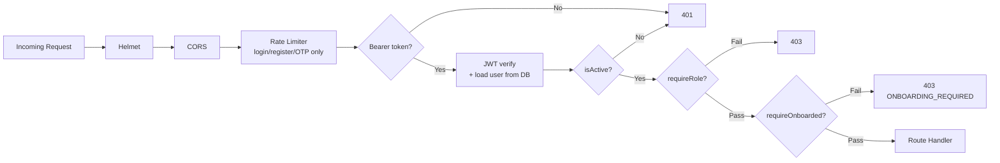

### 4.5 Secrets & Configuration (summary)

All passwords and API keys are stored in **`apps/api/dev.local`** (gitignored).  
Non-secret defaults live in **`apps/api/.env.example`** (safe to commit).  
See [Section 16](#16-secrets--configuration-management) for full details.

---

## 5. Role-Based Access Control (RBAC)

### 5.1 Role Definitions

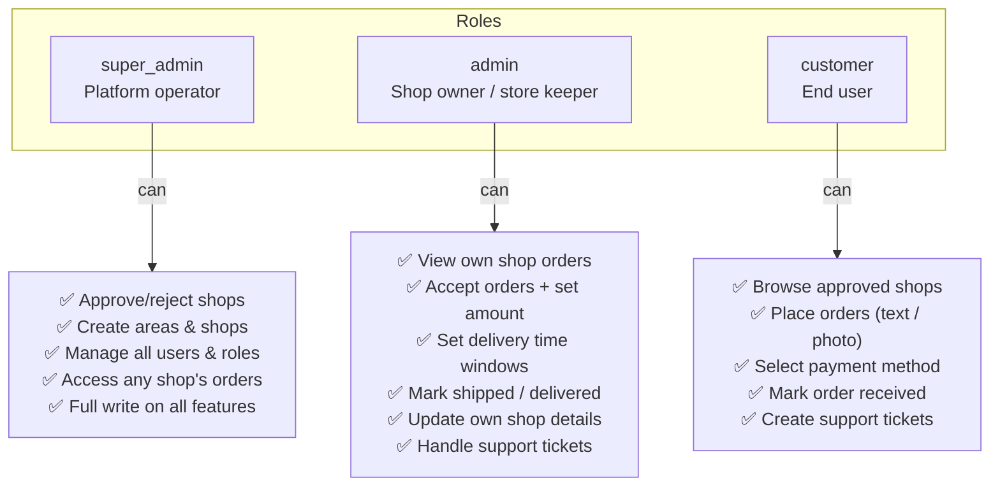

### 5.2 Permission Matrix

| Feature | Super Admin | Admin | Customer |
|---------|:-----------:|:-----:|:--------:|
| Browse shops | ✅ | ✅ | ✅ |
| Place order | ❌ | ❌ | ✅ |
| Accept / ship order | ✅ (any shop) | ✅ (own shop) | ❌ |
| Mark delivered | ✅ | ✅ | ✅ (own order) |
| Apply for shop | ❌ | ✅ | ❌ |
| Approve shop | ✅ | ❌ | ❌ |
| Manage areas | ✅ | ❌ | ❌ |
| Manage users | ✅ | ❌ | ❌ |
| Support tickets (create) | ❌ | ✅ (own shop orders) | ✅ |
| Support tickets (reply) | ✅ | ✅ (own shop) | ✅ (own orders) |
| Support tickets (resolve) | ✅ | ✅ (own shop) | ❌ |
| Onboarding | N/A (seed) | ✅ | ✅ |

### 5.3 Shop Access Scoping

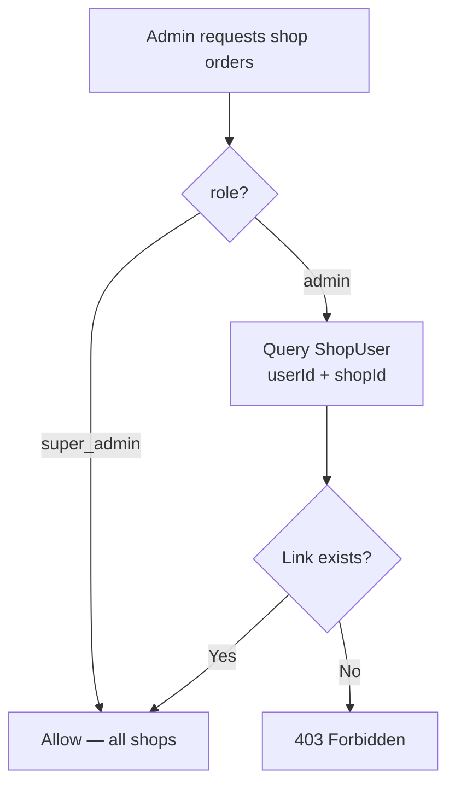

---

## 6. Functional Modules

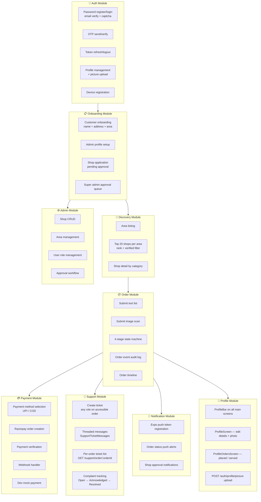

---

## 7. Database Schema

**SQL reference (keep updated with model changes):** [`docs/app.sql`](./app.sql) (schema) · [`docs/seed-data.sql`](./seed-data.sql) (demo data) · [`docs/database.md`](./database.md) (how to apply)

### 7.1 Entity-Relationship Diagram

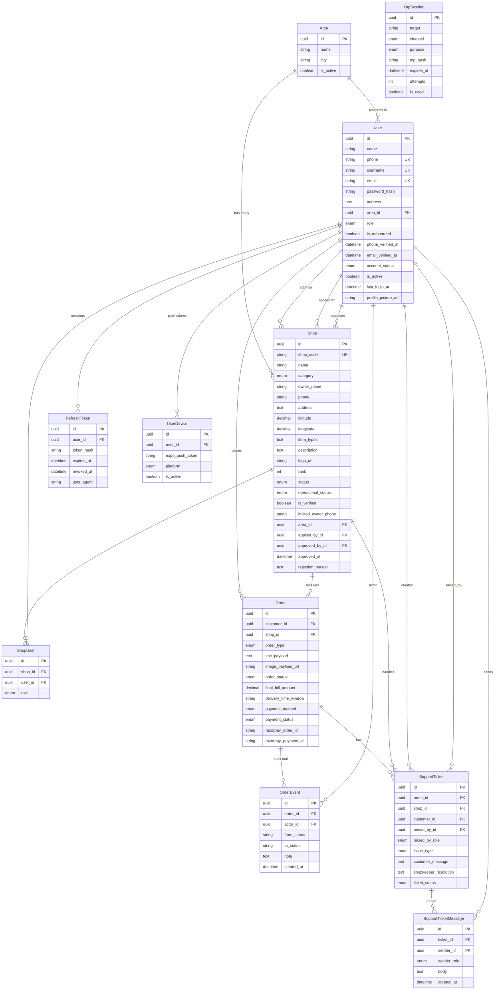

### 7.2 Enums Reference

| Enum | Values |
|------|--------|
| `UserRole` | `super_admin`, `admin`, `customer` |
| `UserAccountStatus` | `enabled`, `disabled`, `on_hold` |
| `ShopStatus` | `invited`, `pending`, `approved`, `rejected` |
| `ShopOperationalStatus` | `enabled`, `disabled`, `on_hold` |
| `ShopCategory` | `Sweets`, `Medicines`, `Vegetables`, `Bakery`, `Grocery`, `Flowers`, `Nursery` |
| `OrderType` | `Text_List`, `Image_Scan`, `Catalog` |

**Visual catalog stores** (Flowers, Nursery, or any shop with `visual_catalog_enabled` and `ShopCatalogItems`): customers browse grouped product images with prices, and may combine catalog picks with a free-text list and/or photo upload on one order screen. Any shop category (Sweets, Grocery, Bakery, etc.) can opt in by setting the flag and adding catalog rows. Hybrid orders store `catalog_payload` (JSONB) plus optional `text_payload` / `image_payload_url`. API: `POST /api/orders/submit-catalog-order` (multipart).
| `OrderStatus` | `Created`, `Accepted`, `Shipped`, `Delivered`, `Rejected`, `Returned` |
| `PaymentMethod` | `UPI_Instant`, `Cash_On_Delivery` |
| `PaymentStatus` | `Pending`, `Paid`, `Failed`, `Not_Required`, `Refund_Pending`, `Refunded` |
| `TicketIssueType` | `Delivery_Instruction`, `Wrong_Item`, `Damaged_Product`, `Delayed_Delivery`, `Other` |
| `TicketStatus` | `Open`, `Acknowledged`, `Resolved` |
| `SupportTicket.raised_by_role` | `customer`, `admin`, `super_admin` |
| `SupportTicketMessage.sender_role` | `customer`, `admin`, `super_admin` |
| `OtpSession.channel` | `sms`, `email` |
| `OtpSession.purpose` | `login`, `register` |

### 7.3 Schema Application & Boot Migrations

Schema is kept in sync via three layers:

1. **Sequelize models** — `sequelize.sync()` on API boot creates missing tables
2. **Incremental migrations** — `migrateSupportSchema()` and `migrateUserProfileSchema()` patch columns that sync cannot alter safely
3. **SQL reference** — [`docs/app.sql`](./app.sql) (v0.4 changelog) for manual `psql` apply

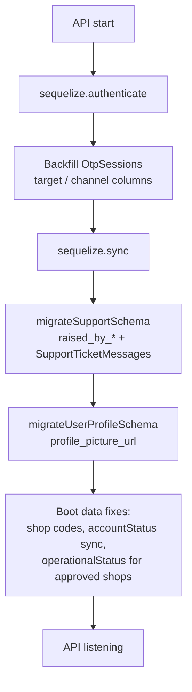

Standalone migration runner (without full server):

```bash
node apps/api/scripts/run-migrations.js
```

See [`docs/database.md`](./database.md) for fresh-database setup and seed options.

---

## 8. Order Lifecycle

### 8.1 State Machine

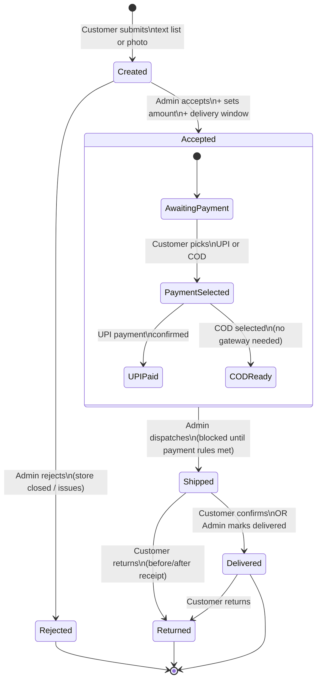

### 8.3 Partial fulfillment & backorders

When a shopkeeper accepts an order but some items are unavailable:

1. **Accept with fulfillment** — `PATCH /transition/accept/:id` accepts a `fulfillment` payload with per-line availability (`fulfilled`, `partial`, `unavailable`), a shop note, and adjusted `finalBillAmount`.
2. **Customer notification** — Customer receives a push explaining unavailable items and the revised bill.
3. **Optional backorder** — If `createBackorder: true`, a child order is created with `parent_order_id` pointing to the original, `order_status = Backorder_Waiting`, and `catalog_payload` containing only missing items.
4. **Backorder activation** — When stock arrives, the shop calls `PATCH /transition/backorder-ready/:id` to move the backorder to `Accepted`; the customer is notified to choose payment and the normal delivery flow continues.

`Orders.fulfillment_payload` (JSONB) stores line-level fulfillment details on the parent order. Child backorders link via `parent_order_id`.

### 8.2 Order Flow Sequence

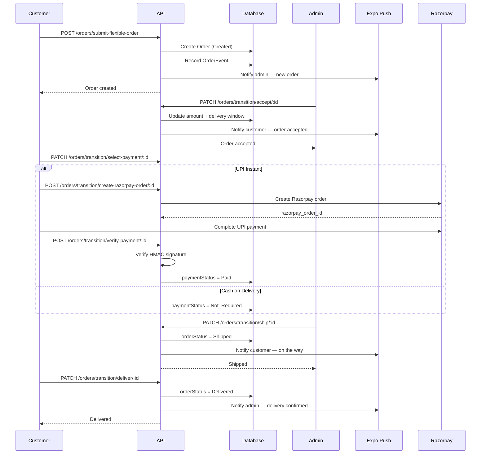

### 8.3 Ship Gate Rules

An order **cannot** be shipped until:

1. `paymentMethod` is set (customer has chosen UPI or COD)
2. If `UPI_Instant` → `paymentStatus` must be `Paid`
3. If `Cash_On_Delivery` → `paymentStatus` is `Not_Required` (no gateway call needed)

---

## 9. Payment Flow

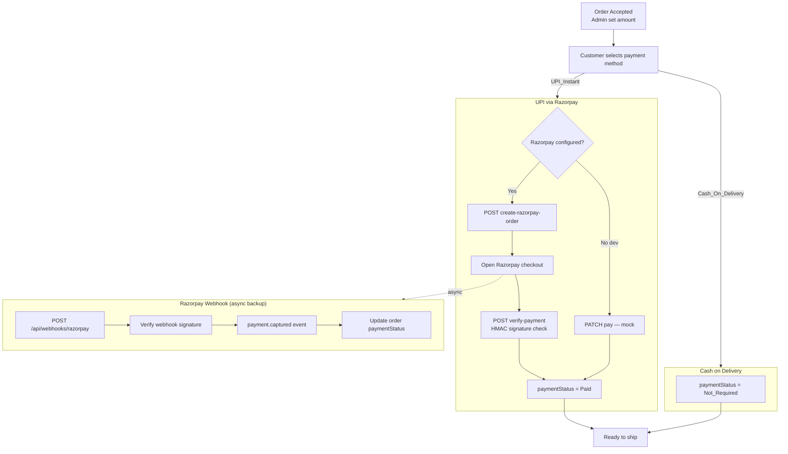

---

## 10. Onboarding Flows

### 10.1 Customer Onboarding

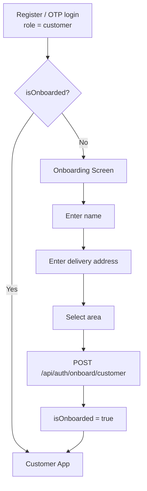

### 10.2 Shop Owner Onboarding

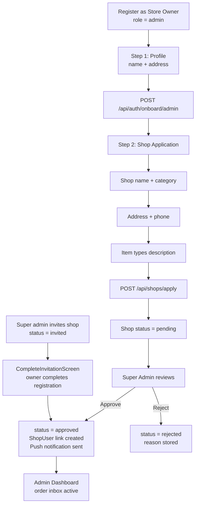

### 10.3 Super Admin Shop Approval

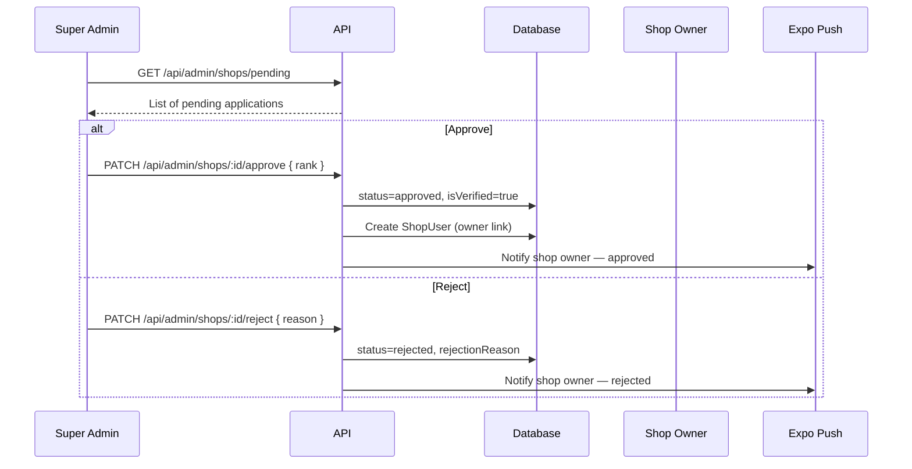

---

## 11. Notifications

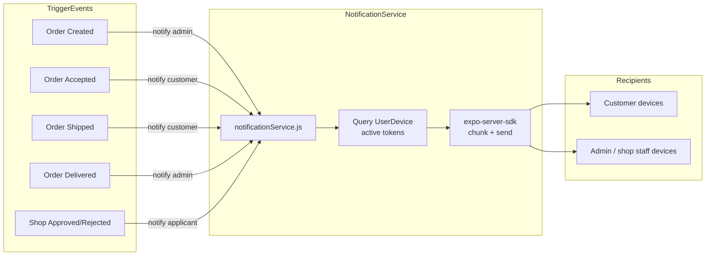

| Event | Recipient | Message |
|-------|-----------|---------|
| Order Created | Shop admin(s) | "New order from {customer}" |
| Order Rejected | Customer | "{shop} could not accept your order" + reason |
| Order Returned | Customer + shop admin | Return recorded; refund required if paid |
| Refund Processed | Customer | "Refund of ₹{amount} processed" |
| Order Accepted | Customer | "Order accepted. Amount: ₹{amount}" |
| Order Shipped | Customer | "Your order has been shipped" |
| Order Delivered | Shop admin(s) | "Order delivered to {customer}" |
| Shop Approved | Applicant | "Your shop is now live on Localite" |
| Shop Rejected | Applicant | "Your application was not approved" |

---

## 12. File Storage

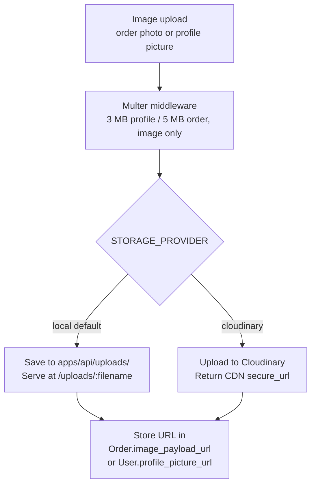

| Upload type | Endpoint | Stored in |
|-------------|----------|-----------|
| Order photo | `POST /api/orders/submit-flexible-order` | `Order.image_payload_url` |
| Profile picture | `POST /api/auth/profile/picture` | `User.profile_picture_url` |

| Provider | Env | Use Case |
|----------|-----|----------|
| `local` | `STORAGE_PROVIDER=local` | Development, no cloud subscription |
| `cloudinary` | `STORAGE_PROVIDER=cloudinary` + cloud credentials | Production CDN |

Mobile resolves relative upload paths via `resolveMediaUrl()` using `API_BASE_URL` / `app.json` `extra.apiUrl`.

---

## 13. API Reference Map

> Full curl examples and Postman collection: [`docs/apicurl/`](./apicurl/)

### Health

| Method | Endpoint | Auth | Description |
|--------|----------|------|-------------|
| GET | `/api/health` | Public | Service status, storage provider, Razorpay enabled flag |

### Auth — `/api/auth`

| Method | Endpoint | Auth | Description |
|--------|----------|------|-------------|
| GET | `/captcha` | Public | Math captcha challenge for registration |
| POST | `/register/send-email-code` | Public | Send email OTP (captcha + rate limited) |
| POST | `/register/verify-email-code` | Public | Verify email OTP → `registrationToken` |
| POST | `/register/password` | Public | Register with password + `registrationToken` |
| POST | `/login/password` | Public | Login with phone/username/email |
| POST | `/send-otp` | Public | Send OTP to phone (rate limited) |
| POST | `/verify-otp` | Public | Verify OTP and login (403 if unregistered phone) |
| POST | `/refresh` | Public | Rotate refresh token |
| POST | `/logout` | Bearer | Revoke refresh token |
| GET | `/me` | Bearer | Current user profile (+ `shops` for admin/super_admin) |
| PATCH | `/profile` | Bearer | Update profile fields |
| POST | `/profile/picture` | Bearer | Upload profile photo (multipart, 3 MB) |
| POST | `/onboard/customer` | Customer | Complete customer onboarding |
| POST | `/onboard/admin` | Bearer | Complete admin profile |
| POST | `/set-password` | Bearer | Set / change password |
| POST | `/device/register` | Bearer | Register Expo push token |
| POST | `/device/unregister` | Bearer | Unregister push token |

### Areas — `/api/areas`

| Method | Endpoint | Auth | Description |
|--------|----------|------|-------------|
| GET | `/` | Public | List active areas |
| GET | `/:areaId` | Public | Area detail |

### Shops — `/api/shops`

| Method | Endpoint | Auth | Description |
|--------|----------|------|-------------|
| GET | `/area/:areaId` | Public | Paginated approved shops (`page`, `limit`, default 20) |
| GET | `/:shopId` | Public | Shop detail |
| POST | `/apply` | Admin | Submit shop application |
| GET | `/my/application` | Admin | Own shop applications |
| GET | `/my/invitations` | Admin | Shops with `invited` status for this phone |
| POST | `/:shopId/complete-registration` | Admin | Complete invited shop registration |
| PATCH | `/my/:shopId` | Admin | Update own shop details |

### Orders — `/api/orders`

| Method | Endpoint | Auth | Description |
|--------|----------|------|-------------|
| POST | `/submit-flexible-order` | Customer | Place order (text/image) |
| GET | `/my` | Customer | Customer's orders |
| GET | `/shop/:shopId` | Admin | Shop order inbox |
| GET | `/:orderId` | Bearer | Order detail + timeline |
| PATCH | `/transition/accept/:id` | Admin | Accept + set amount/window; optional `fulfillment.lines`, `fulfillment.shopNote`, `createBackorder` for partial availability |
| PATCH | `/transition/backorder-ready/:id` | Admin | Activate backorder when stock arrives (`Backorder_Waiting` → `Accepted`) |
| PATCH | `/transition/reject/:id` | Admin | Reject with reason (Created only); notifies customer |
| PATCH | `/transition/return/:id` | Customer | Return shipped/delivered order; sets `Refund_Pending` if already paid |
| POST | `/transition/refund/:id` | Admin | Process Razorpay refund to customer for returned paid order |
| PATCH | `/transition/select-payment/:id` | Customer | Choose UPI or COD |
| POST | `/transition/create-razorpay-order/:id` | Customer | Create Razorpay order |
| POST | `/transition/verify-payment/:id` | Customer | Verify UPI payment |
| PATCH | `/transition/pay/:id` | Customer | Dev mock payment |
| PATCH | `/transition/ship/:id` | Admin | Mark shipped |
| PATCH | `/transition/deliver/:id` | Customer/Admin | Mark delivered |

### Support — `/api/support`

| Method | Endpoint | Auth | Description |
|--------|----------|------|-------------|
| POST | `/create-ticket` | Bearer | Create support ticket (customer or shop on accessible order) |
| GET | `/order/:orderId` | Bearer | Tickets + threaded messages for an order |
| POST | `/tickets/:ticketId/messages` | Bearer | Reply on an open ticket |
| GET | `/my` | Customer | Own tickets |
| GET | `/merchant/active/:shopId` | Admin | Shop's active tickets |
| PATCH | `/update-ticket/:id` | Admin | Acknowledge / resolve |

### Admin — `/api/admin` (Super Admin only)

| Method | Endpoint | Description |
|--------|----------|-------------|
| GET | `/shops/pending` | Pending shop applications |
| PATCH | `/shops/:id/approve` | Approve shop |
| PATCH | `/shops/:id/reject` | Reject shop |
| GET | `/shops` | All shops (paginated) |
| POST | `/shops` | Directly create shop |
| POST | `/shops/invite` | Create invited shop + notify owner |
| PATCH | `/shops/:id` | Edit shop fields |
| PATCH | `/shops/:id/operational-status` | Enable / disable / on_hold |
| DELETE | `/shops/:id` | Delete shop (if no orders) |
| POST | `/areas` | Create area |
| GET | `/users` | All users (paginated) |
| POST | `/users` | Create customer or admin user |
| PATCH | `/users/:id` | Edit user fields |
| PATCH | `/users/:id/account-status` | Enable / disable / on_hold (+ revoke tokens) |
| PATCH | `/users/:id/role` | Change user role |
| DELETE | `/users/:id` | Delete user (if no orders) |

### Webhooks — `/api/webhooks`

| Method | Endpoint | Description |
|--------|----------|-------------|
| POST | `/razorpay` | Razorpay payment.captured webhook |

---

## 14. Mobile App Navigation

### Layout pattern

Most authenticated screens use **`ScreenLayout`**, which renders **`ProfileBar`** at the top (avatar, name or shop name, **Profile** button). Support is available per-order via **`OrderSupportButton`** (modal with ticket list, threaded messages, and reply).

In `__DEV__`, **`LoginScreen`** shows a collapsible demo-accounts panel (`devDemoAccounts.js`) for quick credential fill.

```mermaid
flowchart TD
    START([App Launch]) --> LOAD[Load tokens\nfrom SecureStore]
    LOAD --> AUTH{Authenticated?}

    AUTH -->|No| LOGIN[LoginScreen\nPassword tab | OTP tab\n+ dev demo accounts]
    AUTH -->|Yes| ONBOARD{isOnboarded?}

    ONBOARD -->|No| ONBOARD_ROUTE{role?}
    ONBOARD_ROUTE -->|customer| C_ONB[CustomerOnboardingScreen]
    ONBOARD_ROUTE -->|admin| A_ONB[AdminOnboardingScreen\nStep 1: Profile\nStep 2: Shop Application]

    ONBOARD -->|Yes| ROLE{role?}

    ROLE -->|super_admin| SA_NAV[SuperAdminStack]
    SA_NAV --> SA1[SuperAdminDashboard\nShops tab | Users tab]
    SA_NAV --> SA2[ProfileScreen]
    SA_NAV --> SA3[ProfileOrdersScreen]

    ROLE -->|admin| ADM_NAV[AdminStack]
    ADM_NAV --> ADM1[ShopInboxScreen\nOrder inbox + invitation banner]
    ADM_NAV --> ADM2[CompleteInvitationScreen\nInvited shop registration]
    ADM_NAV --> ADM3[ManageOrderScreen\nAccept / Ship / Deliver]
    ADM_NAV --> ADM4[ProfileScreen]
    ADM_NAV --> ADM5[ProfileOrdersScreen\nOrders served]

    ROLE -->|customer| CUS_NAV[CustomerStack]
    CUS_NAV --> CUS_TABS[Bottom Tabs]
    CUS_TABS --> CUS1[ShopListScreen\nBrowse stores]
    CUS_TABS --> CUS2[MyOrdersScreen\nOrder history + support]
    CUS_NAV --> CUS3[PlaceOrderScreen\nText + photo upload]
    CUS_NAV --> CUS4[OrderDetailScreen\nTrack + Pay + Deliver + support]
    CUS_NAV --> CUS5[ProfileScreen]
    CUS_NAV --> CUS6[ProfileOrdersScreen\nOrders placed]
```

### Order screen details (customer + shop)

| Screen | Key UI |
|--------|--------|
| `MyOrdersScreen` | Order cards with status, amount, payment; UPI/COD selection; mark received; support button |
| `OrderDetailScreen` | Full timeline, payment section, support button |
| `ShopInboxScreen` | Order status, amount, payment status columns; support button |
| `ManageOrderScreen` | Payment badges; ship gated on payment confirmation |

---

## 15. External Integrations

```mermaid
flowchart LR
    subgraph Localite
        API[Express API]
        MOBILE[Expo Mobile]
    end

    subgraph Production
        RZP[Razorpay\nUPI payments]
        EXPO[Expo Push Service\nnotifications]
        CLD[Cloudinary\nimage CDN]
        SMS[SMS / Email\nTwilio + SMTP]
    end

    subgraph Infrastructure
        PG[(PostgreSQL)]
        DOCKER[Docker Compose\ndev database]
    end

    MOBILE -->|JWT REST| API
    API --> PG
    DOCKER -.->|hosts| PG
    API -->|create/verify orders| RZP
    RZP -->|webhook| API
    API -->|push tokens| EXPO
    EXPO -->|deliver| MOBILE
    API -.->|image upload| CLD
    API -.->|OTP delivery| SMS
```

| Integration | Status | Config file |
|-------------|--------|-------------|
| PostgreSQL | ✅ Active | `DB_*` in `.env` / password in `dev.local` |
| Razorpay UPI | ✅ Ready (mock in dev) | `RAZORPAY_*` in `dev.local` |
| Expo Push | ✅ Active | `expo-server-sdk` + device registration |
| Local Storage | ✅ Default | `STORAGE_PROVIDER=local` in `.env` |
| Cloudinary | ✅ Ready | `CLOUDINARY_*` in `dev.local` |
| SMS / Email OTP | ✅ Ready (console fallback in dev) | `TWILIO_*`, `SMTP_*` in `dev.local` |

---

## 16. Secrets & Configuration Management

### 16.1 Policy

> **All passwords, tokens, and API keys MUST live in `dev.local` and MUST NEVER be checked into git.**

| File | Committed? | Purpose |
|------|:----------:|---------|
| `apps/api/.env.example` | ✅ Yes | Non-secret defaults (ports, DB host, timeouts) |
| `apps/api/dev.local.example` | ✅ Yes | Template showing which secret keys are needed |
| `apps/api/dev.local` | 🚫 **Never** | Real passwords, JWT secrets, API keys |
| `apps/api/.env` | 🚫 **Never** | Optional local overrides (also gitignored) |

### 16.2 Environment Loading Order

`apps/api/src/config/loadEnv.js` is called at startup by `server.js`, `database.js`, and `seed.js`.

```mermaid
flowchart TD
    START([API starts]) --> LOAD1{apps/api/.env\nexists?}
    LOAD1 -->|Yes| ENV[Load .env\nnon-secret defaults]
    LOAD1 -->|No| LOAD2
    ENV --> LOAD2{apps/api/dev.local\nexists?}
    LOAD2 -->|Yes| LOCAL[Load dev.local\noverride with secrets]
    LOAD2 -->|No| WARN[Console warning:\ncopy dev.local.example]
    LOCAL --> READY[process.env populated]
    WARN --> READY
```

**Override rule:** `dev.local` always wins over `.env` for duplicate keys.

### 16.3 First-Time Developer Setup

```bash
cd Localite
npm install

# Non-secret defaults (optional)
cp apps/api/.env.example apps/api/.env

# Secrets — required
cp apps/api/dev.local.example apps/api/dev.local
# Edit dev.local with your real passwords before running seed/api
```

### 16.4 What Goes Where

| Variable | File | Secret? |
|----------|------|:-------:|
| `PORT`, `NODE_ENV`, `API_BASE_URL` | `.env` | No |
| `DB_NAME`, `DB_USER`, `DB_HOST`, `DB_PORT` | `.env` | No |
| `DB_PASSWORD` | `dev.local` | **Yes** |
| `JWT_SECRET`, `JWT_REFRESH_SECRET` | `dev.local` | **Yes** |
| `JWT_ACCESS_EXPIRY`, `JWT_REFRESH_EXPIRY_DAYS` | `.env` | No |
| `DEV_OTP` | `dev.local` | **Yes** |
| `BCRYPT_ROUNDS`, `OTP_TTL_MS`, `OTP_MAX_ATTEMPTS` | `.env` | No |
| `STORAGE_PROVIDER`, `UPLOAD_DIR` | `.env` | No |
| `RAZORPAY_KEY_ID`, `RAZORPAY_KEY_SECRET`, `RAZORPAY_WEBHOOK_SECRET` | `dev.local` | **Yes** |
| `CLOUDINARY_CLOUD_NAME`, `CLOUDINARY_API_KEY`, `CLOUDINARY_API_SECRET` | `dev.local` | **Yes** |
| `SUPER_ADMIN_PHONE`, `SUPER_ADMIN_PASSWORD` | `dev.local` | **Yes** |
| `SUPER_ADMIN_NAME` | `.env` | No |
| `DISABLE_AUTH_RATE_LIMIT` | `dev.local` | No (set `true` to skip rate limits in dev) |
| `RECAPTCHA_SECRET_KEY` | `dev.local` | **Yes** (optional; math captcha used if unset) |
| `TWILIO_*`, `SMTP_*` | `dev.local` | **Yes** (optional; console fallback in dev) |

### 16.5 Gitignore Rules

Root `.gitignore` blocks all secret files from ever being committed:

```text
# Secrets — NEVER commit
.env
.env.*
!.env.example
dev.local
**/dev.local
*.dev.local
.env.local
.env.development.local
.env.production.local
secrets/
**/secrets/
```

Verify locally:

```bash
git check-ignore -v apps/api/dev.local
# Expected: Localite/.gitignore:**/dev.local  apps/api/dev.local
```

### 16.6 Production Considerations

In production, do **not** use `dev.local`. Instead inject secrets via:

- Cloud provider secret managers (AWS Secrets Manager, GCP Secret Manager, Azure Key Vault)
- CI/CD pipeline environment variables
- Container orchestration secrets (Kubernetes Secrets, Docker Swarm secrets)

The `loadEnv()` pattern is for **local development only**. Production should set `NODE_ENV=production` and supply secrets through the deployment platform.

---

## 17. Dev Tooling & Scripts

### npm scripts (root `package.json`)

| Command | Description |
|---------|-------------|
| `npm run api` | Start API with `--watch` on port 5000 |
| `npm run mobile` | Start Expo dev server |
| `npm run api:seed` | Run `apps/api/src/seeders/seed.js` — areas, users, shops, demo data |

### Standalone scripts

| Command | Description |
|---------|-------------|
| `node apps/api/scripts/run-migrations.js` | Apply schema migrations without full server boot |
| `node apps/api/scripts/sync-demo-data.js` | Upsert demo users + 10 seeded shop owners |

### SQL reference files

| File | Purpose |
|------|---------|
| `docs/app.sql` | Canonical PostgreSQL schema (v0.4) |
| `docs/seed-data.sql` | Demo data with fixed UUIDs |
| `docs/database.md` | How to apply schema + seed manually via `psql` |

### Mobile dev config

| File | Purpose |
|------|---------|
| `apps/mobile/app.json` → `extra.apiUrl` | LAN IP for physical device testing (not `localhost`) |
| `apps/mobile/src/config/devDemoAccounts.js` | Quick-fill credentials on login screen (`__DEV__` only) |

### Demo credentials (after seed)

| Role | Login | Password |
|------|-------|----------|
| Customer | `8888888888` or `customer1` | `Customer@123` |
| Shop Admin | `9999999999` or `shopadmin` | `Admin@12345` |
| Super Admin | `9000000001` or `superadmin` | `SuperAdmin@123` |
| Shop owners | `9876500001`–`9876500010` | `Admin@12345` |
| OTP / email code (dev) | — | `123456` (`DEV_OTP` in `dev.local`) |

---

## Appendix: Environment Variable Reference

### dev.local (secrets — 🚫 never commit)

Copy from `apps/api/dev.local.example`:

```env
# Database password
DB_PASSWORD=your_db_password

# JWT signing secrets (use long random strings)
JWT_SECRET=your-jwt-secret-min-32-chars
JWT_REFRESH_SECRET=your-refresh-secret-min-32-chars

# Dev OTP (development only)
DEV_OTP=123456

# Skip auth rate limits during heavy dev testing
# DISABLE_AUTH_RATE_LIMIT=true

# Super admin seed credentials
SUPER_ADMIN_PHONE=9000000001
SUPER_ADMIN_PASSWORD=YourStrongPassword@123

# Razorpay (leave empty to use dev mock payment)
# RAZORPAY_KEY_ID=rzp_test_xxxxx
# RAZORPAY_KEY_SECRET=xxxxx
# RAZORPAY_WEBHOOK_SECRET=xxxxx

# Cloudinary (only when STORAGE_PROVIDER=cloudinary)
# CLOUDINARY_CLOUD_NAME=xxxxx
# CLOUDINARY_API_KEY=xxxxx
# CLOUDINARY_API_SECRET=xxxxx
```

### .env / .env.example (non-secret — ✅ safe to commit)

```env
# Server
PORT=5000
NODE_ENV=development
API_BASE_URL=http://localhost:5000

# Database (password in dev.local)
DB_NAME=localite_db
DB_USER=postgres
DB_HOST=localhost
DB_PORT=5432

# JWT timing (secrets in dev.local)
JWT_ACCESS_EXPIRY=15m
JWT_REFRESH_EXPIRY_DAYS=7

# Auth settings (OTP value in dev.local)
BCRYPT_ROUNDS=12
OTP_TTL_MS=300000
OTP_MAX_ATTEMPTS=5

# Storage (Cloudinary credentials in dev.local)
STORAGE_PROVIDER=local
UPLOAD_DIR=uploads

# Super admin display name (credentials in dev.local)
SUPER_ADMIN_NAME=Super Admin
```
Demo logins (after seed):

| Role | Login | Email | Password |
|------|-------|-------|----------|
| Customer | 8888888888 | customer@localite.dev | Customer@123 |
| Shop Admin | 9999999999 | shopkeeper@localite.dev | Admin@12345 |
| Super Admin | 9000000001 | superadmin@localite.dev | SuperAdmin@123 |
| OTP (any phone) | — | — | 123456 |

Email security code in dev: **123456** (same as `DEV_OTP` in `dev.local`).
---

*Last updated: August 2026 · Localite MVP v0.6 · secrets via dev.local*
