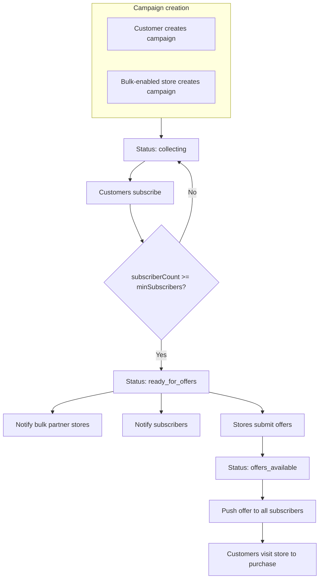
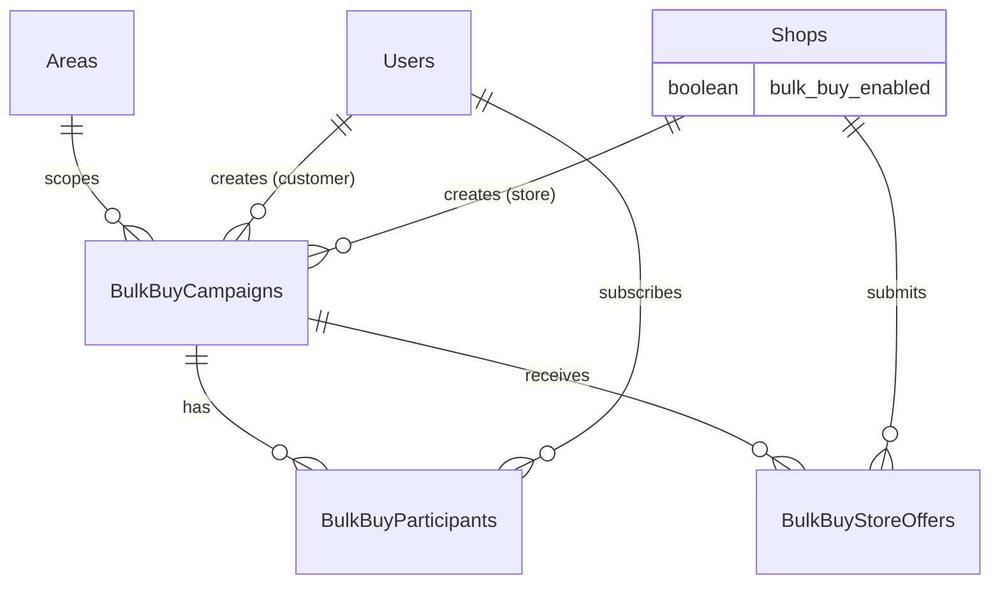
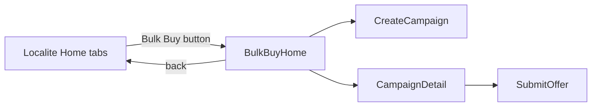

# Bulk Buy — Architecture (v0.11)

> Group buying for big-ticket electronics (refrigerators, TVs, washing machines, mobiles, etc.) in a hyperlocal area. Customers (or stores) start campaigns; interested buyers subscribe; when a threshold is reached, partner stores submit competitive offers; all subscribers are notified.

**Introduced:** v0.11  
**Stack:** Same monorepo as core Localite — `apps/api`, `apps/mobile`, `packages/shared`  
**API base path:** `/api/bulk-buy`  
**Manual API reference:** [`docs/apicurl/09-bulk-buy.md`](./apicurl/09-bulk-buy.md)

---

## Table of Contents

1. [Purpose & boundaries](#1-purpose--boundaries)
2. [How it differs from regular orders](#2-how-it-differs-from-regular-orders)
3. [High-level flow](#3-high-level-flow)
4. [Actors & permissions](#4-actors--permissions)
5. [Campaign lifecycle](#5-campaign-lifecycle)
6. [Database schema](#6-database-schema)
7. [API layer](#7-api-layer)
8. [Services & business rules](#8-services--business-rules)
9. [Notifications](#9-notifications)
10. [Mobile app module](#10-mobile-app-module)
11. [Shared package](#11-shared-package)
12. [File map](#12-file-map)
13. [MVP scope & future work](#13-mvp-scope--future-work)

---

## 1. Purpose & boundaries

Bulk Buy solves **group demand aggregation** for expensive items where a neighborhood (society, complex, area) can unlock better store pricing:

- 10+ people want the same class of product (e.g. refrigerator)
- Vijay Sales, Chroma, Reliance Digital–style partners bid with discount + warranty + freebies
- Subscribers compare offers and purchase **at the store** (MVP: out-of-app fulfillment)

Bulk Buy is intentionally **isolated** from the kirana/grocery order pipeline. It does not use `Orders`, Razorpay checkout, or catalog cart flows.

| In scope (v0.11) | Out of scope (v0.11) |
|------------------|----------------------|
| Campaign create (customer or store) | In-app payment for bulk items |
| Subscribe / withdraw interest | Order state machine integration |
| Threshold → store inbox | Voting between offers |
| Store competitive offers | WhatsApp campaign sharing API |
| Push to subscribers & stores | Purchase confirmation tracking |
| Area-scoped discovery | Cross-area campaigns |

---

## 2. How it differs from regular orders

| Dimension | Regular Localite order | Bulk Buy campaign |
|-----------|------------------------|-------------------|
| Product type | Groceries, sweets, flowers, etc. | Electronics / appliances |
| Pricing | Shop sets after accept | Store offers after group threshold |
| Commitment | Order placed immediately | Soft interest (subscribe) |
| Payment | UPI / COD in app | At store (MVP) |
| Tables | `Orders`, `OrderEvents` | `BulkBuyCampaigns`, `BulkBuyParticipants`, `BulkBuyStoreOffers` |
| Mobile UI | Tabs: Home, Orders, Stores | Separate **Bulk Buy** entry → own navigator |
| Shop flag | `operationalStatus` | `bulkBuyEnabled` (super admin) |

---

## 3. High-level flow



### Dual-origin campaigns

| Creator | `created_by_type` | Required fields |
|---------|-------------------|-----------------|
| Customer | `customer` | `title`, `productCategory`, `areaId` (defaults to user area) |
| Store admin | `store` | Above + `shopId` (must have `bulkBuyEnabled`) |

Both origins share the same subscribe → threshold → offer → notify flow.

---

## 4. Actors & permissions

| Actor | Capabilities |
|-------|----------------|
| **Customer** (onboarded) | List campaigns in area, create campaign, subscribe / unsubscribe, view offers |
| **Store admin** (onboarded, `bulkBuyEnabled` shop) | Create store campaign, view inbox, submit/update offer for campaigns in same area |
| **Super admin** | Enable `bulkBuyEnabled` on shops, full API access, sees all inbox campaigns |

Middleware on all bulk-buy routes: `authenticate` + `requireOnboarded`.

Role gates:

- `POST/DELETE .../subscribe` — `requireRole(customer)`
- `GET .../inbox`, `POST .../offers` — `requireRole(admin, super_admin)`

---

## 5. Campaign lifecycle

### Status enum (`BulkBuyCampaignStatus`)

```
collecting → ready_for_offers → offers_available → closed | expired | cancelled
```

| Status | Meaning |
|--------|---------|
| `collecting` | Accepting new subscribers |
| `ready_for_offers` | Threshold met; stores can submit offers |
| `offers_available` | At least one store offer published |
| `closed` | Manually ended (future) |
| `expired` | Past `deadlineAt` without completion (future job) |
| `cancelled` | Creator/admin cancelled (future) |

### Participant status (`BulkBuyParticipantStatus`)

| Status | Meaning |
|--------|---------|
| `subscribed` | Counted toward threshold |
| `withdrawn` | Customer left while still `collecting` |

### Threshold transition

When `count(subscribed) >= minSubscribers` while status is `collecting`:

1. Set `status = ready_for_offers`, `thresholdReachedAt = now()`
2. Push **subscribers**: threshold reached, stores preparing offers
3. Push **bulk partner store staff** in the same `areaId`: new opportunity in inbox

Default `minSubscribers` = **10** (`DEFAULT_BULK_BUY_MIN_SUBSCRIBERS` in shared). Minimum allowed = **2**.

---

## 6. Database schema

Migration: `apps/api/src/services/bulkBuySchemaMigration.js` (v0.11)  
Reference: `docs/app.sql` changelog v0.11

### Shops extension

| Column | Type | Description |
|--------|------|-------------|
| `bulk_buy_enabled` | `BOOLEAN` | Partner flag; set by super admin |

### BulkBuyCampaigns

| Column | Type | Description |
|--------|------|-------------|
| `id` | UUID | PK |
| `area_id` | UUID | FK → Areas |
| `created_by_type` | enum | `customer` \| `store` |
| `created_by_customer_id` | UUID? | FK → Users |
| `created_by_shop_id` | UUID? | FK → Shops |
| `title` | VARCHAR | Campaign title |
| `product_category` | enum | See below |
| `description` | TEXT? | Free text specs |
| `brand_preference` | VARCHAR? | e.g. LG, Samsung |
| `min_subscribers` | INT | Default 10, min 2 |
| `status` | enum | Campaign lifecycle |
| `deadline_at` | TIMESTAMPTZ? | Optional end date |
| `threshold_reached_at` | TIMESTAMPTZ? | When threshold hit |

**Product categories:** `refrigerator`, `washing_machine`, `television`, `mobile`, `air_conditioner`, `other`

### BulkBuyParticipants

| Column | Type | Description |
|--------|------|-------------|
| `campaign_id` | UUID | FK → BulkBuyCampaigns |
| `customer_id` | UUID | FK → Users |
| `status` | enum | `subscribed` \| `withdrawn` |

Unique: `(campaign_id, customer_id)`

### BulkBuyStoreOffers

| Column | Type | Description |
|--------|------|-------------|
| `campaign_id` | UUID | FK → BulkBuyCampaigns |
| `shop_id` | UUID | FK → Shops |
| `discount_type` | VARCHAR | `percent`, `flat`, `text` |
| `discount_value` | DECIMAL? | Numeric discount |
| `extras` | JSONB | `{ extendedWarrantyMonths, freebies, installation }` |
| `terms_text` | TEXT? | Fine print |
| `valid_until` | TIMESTAMPTZ? | Offer expiry |
| `submitted_by_user_id` | UUID? | FK → Users |

Unique: `(campaign_id, shop_id)` — one offer per store per campaign (upsert on resubmit).

### ER diagram



---

## 7. API layer

Router: `apps/api/src/routes/bulkBuyRoutes.js`  
Mounted at: `app.use('/api/bulk-buy', bulkBuyRoutes)` in `apps/api/src/app.js`

| Method | Path | Role | Description |
|--------|------|------|-------------|
| GET | `/campaigns` | Any onboarded | List active campaigns in `areaId` |
| POST | `/campaigns` | Customer or store admin | Create campaign |
| GET | `/campaigns/mine` | Creator | Campaigns created by user/shop |
| GET | `/campaigns/inbox` | Store admin | Threshold-met campaigns for partner stores |
| GET | `/campaigns/:campaignId` | Any onboarded | Detail + offers + `isSubscribed` |
| POST | `/campaigns/:campaignId/subscribe` | Customer | Subscribe |
| DELETE | `/campaigns/:campaignId/subscribe` | Customer | Withdraw (collecting only) |
| GET | `/campaigns/:campaignId/offers` | Any onboarded | List store offers |
| POST | `/campaigns/:campaignId/offers` | Store admin | Submit or update offer |

**Admin (shop enablement):** `PATCH /api/admin/shops/:shopId` with `{ "bulkBuyEnabled": true }` — not under `/api/bulk-buy`.

Route ordering note: `/campaigns/inbox` and `/campaigns/mine` are registered **before** `/campaigns/:campaignId` to avoid param capture.

---

## 8. Services & business rules

| Service | Responsibility |
|---------|----------------|
| `bulkBuyService.js` | CRUD, subscribe, threshold, offers, serialization |
| `bulkBuyNotificationService.js` | Push on threshold and new offers |
| `bulkBuySchemaMigration.js` | DDL for v0.11 tables |

### Key rules

1. **Area scoping** — Campaigns list and store offers require shop `areaId` to match campaign `areaId`.
2. **Subscribe** — Only while `status === collecting`. Re-subscribe after `withdrawn` is allowed.
3. **Unsubscribe** — Blocked after threshold (not `collecting`).
4. **Store offer** — Shop must be `bulkBuyEnabled` and linked to user via `ShopUsers`. Campaign must be `ready_for_offers` or `offers_available`.
5. **Offer upsert** — Same shop resubmitting updates the existing row; triggers subscriber notification again.
6. **First offer** — Transitions campaign from `ready_for_offers` → `offers_available`.

### Serialized campaign shape (API response)

Includes: `subscriberCount`, `minSubscribers`, `productCategoryLabel`, `createdByCustomer`, `createdByShop`, `isSubscribed`, `offerCount`, nested `offers` on detail fetch.

---

## 9. Notifications

Uses existing Expo push infrastructure (`notificationService.sendPushToUser`).

| Event | Recipients | Payload hint |
|-------|------------|----------------|
| Threshold reached | All subscribed customers | `screen: BulkBuyCampaign`, `campaignId` |
| Threshold reached | Staff of `bulkBuyEnabled` shops in area | `screen: BulkBuyInbox`, `campaignId` |
| Store offer published | All subscribed customers | `screen: BulkBuyCampaign`, `campaignId`, `offerId` |

Failures are swallowed (`.catch(() => {})`) so notification errors do not block the main transaction.

---

## 10. Mobile app module

Bulk Buy is a **separate UI module** inside the same Expo app — not mixed into grocery order screens.

### Entry point

- **Bulk Buy** text button in tab header (`BulkBuyHeaderButton`) for customer and shopkeeper tabs
- Navigates to `BulkBuyHome` stack screen

### Screens (`apps/mobile/src/bulk-buy/screens/`)

| Screen | Purpose |
|--------|---------|
| `BulkBuyHomeScreen` | Area campaigns + store inbox section |
| `CreateCampaignScreen` | Customer or store creates campaign |
| `CampaignDetailScreen` | Progress, subscribe, view offers |
| `SubmitOfferScreen` | Store submits discount / warranty / terms |

### API client

Methods appended to `apps/mobile/src/services/api.js`:

- `getBulkBuyCampaigns`, `createBulkBuyCampaign`, `getBulkBuyCampaign`
- `subscribeBulkBuyCampaign`, `unsubscribeBulkBuyCampaign`
- `getBulkBuyInbox`, `getMyBulkBuyCampaigns`, `submitBulkBuyOffer`

### Navigation

Registered in `CustomerStack`, `AdminStack`, and `SuperAdminStack` in `App.js` via shared `bulkBuyScreens` fragment.



---

## 11. Shared package

`packages/shared/src/enums.js`:

- `BulkBuyProductCategory`
- `BulkBuyCampaignCreatorType`
- `BulkBuyCampaignStatus`
- `BulkBuyParticipantStatus`
- `DEFAULT_BULK_BUY_MIN_SUBSCRIBERS` (= 10)

`packages/shared/src/bulkBuyUtils.js`:

- `BULK_BUY_PRODUCT_LABELS`, `getBulkBuyProductLabel()`
- `formatBulkBuyProgress()`, `formatBulkBuyDiscount()`

Exported from `packages/shared/src/index.js` for API and mobile.

---

## 12. File map

```
apps/api/src/
├── routes/bulkBuyRoutes.js
├── services/
│   ├── bulkBuyService.js
│   ├── bulkBuyNotificationService.js
│   └── bulkBuySchemaMigration.js
├── models/
│   ├── BulkBuyCampaign.js
│   ├── BulkBuyParticipant.js
│   └── BulkBuyStoreOffer.js
└── bootstrap.js                    # calls migrateBulkBuySchema()

apps/mobile/src/
├── components/BulkBuyHeaderButton.js
└── bulk-buy/screens/
    ├── BulkBuyHomeScreen.js
    ├── CreateCampaignScreen.js
    ├── CampaignDetailScreen.js
    └── SubmitOfferScreen.js

packages/shared/src/
├── enums.js                        # bulk buy enums
└── bulkBuyUtils.js

apps/api/tests/bulkBuy.test.js
docs/apicurl/09-bulk-buy.md
```

---

## 13. MVP scope & future work

### Shipped in v0.11

- Full campaign + subscribe + threshold + offer loop
- Customer- and store-created campaigns
- Competitive multi-store offers
- Push notifications
- Isolated mobile module
- API tests (`bulkBuy.test.js`)

### Planned enhancements

| Feature | Notes |
|---------|-------|
| `expired` / `cancelled` automation | Cron on `deadlineAt` |
| Firm commitment / token deposit | Stronger guarantee for stores |
| Offer voting or creator pick | Choose winning store in-app |
| `purchased` confirmation | Track fulfillment per subscriber |
| Share campaign link | Society WhatsApp deep link |
| Super admin moderation | Approve customer campaigns |
| Analytics | Conversion rate per store / category |

---

## Related documentation

- [System architecture](./architecture.md) — core platform
- [API curl reference](./apicurl/09-bulk-buy.md) — manual testing
- [Schema reference](./app.sql) — PostgreSQL changelog
